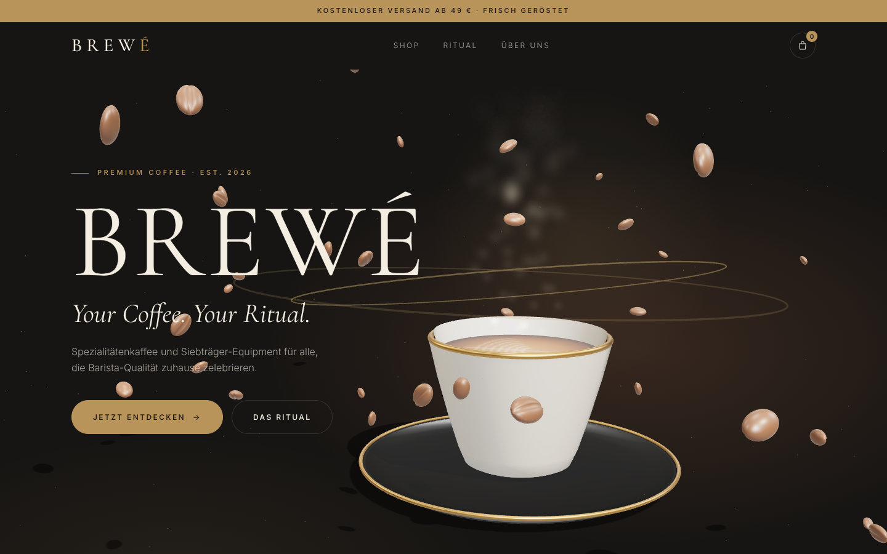

# BREWÉ — Shopify Theme

**Your Coffee. Your Ritual.** A motion-animated Shopify theme (Online Store 2.0) for a premium coffee and espresso brand. It has a real-time 3D hero built with Three.js.



## What's inside

| Area | Motion / 3D |
|---|---|
| **3D Hero** (`brewe-hero`) | Procedural espresso cup with latte-art crema, gold rim and black saucer. It rises in, slowly rotates, and follows the mouse. Steam is a GPU shader. 48 floating coffee beans, gold orbit rings and dust parallax react to scroll. |
| **Headlines** | Letter-by-letter 3D entrance (`data-split`) |
| **Laufband** (`brewe-marquee`) | Endless slogan ticker |
| **Produkt-Showcase** (`brewe-products`) | 3D tilt cards with light glare, quick-add "+", and an AJAX cart where a bean flies to the cart icon |
| **Ritual** (`brewe-ritual`) | Pinned scroll story: Mahlen → Tampen → Extrahieren → Genießen, with a rotating orb and value morphs |
| **Versprechen / CTA-Banner** | Reveals, parallax beans, magnetic buttons |
| **Footer** | Newsletter (Shopify customer form) and a large parallax wordmark |

Also included: product page (variant pills, quantity stepper, gallery), collection, cart, search, page and 404 templates.

Colors: Espresso Black `#171513` · Cream `#F3EDE2` · Coffee Brown `#6B4632` · Warm Gold `#B8945A` · Off White `#FAF8F3`.
Fonts: Cormorant Garamond and Inter.

Accessibility and performance:
- `prefers-reduced-motion` gets a static render.
- If WebGL is unavailable, a CSS gradient replaces the 3D scene.
- The render loop pauses when the hero is off-screen.
- Mobile uses fewer particles.
- The theme ships no 3D model files: all geometry is generated in code.

## Install

**Option A: Upload as ZIP**
1. Zip the *contents* of this folder: `cd brewe-theme && zip -r ../brewe-theme.zip layout config sections snippets templates assets locales`.
2. In Shopify admin, go to **Online Store → Themes → Add theme → Upload zip file**.
3. Preview it, then click **Publish**.

**Option B: Shopify CLI**
```bash
cd brewe-theme
shopify theme push --unpublished --store <your-store>.myshopify.com
```

All texts (slogan, ritual steps, banner) are editable in the theme editor.
